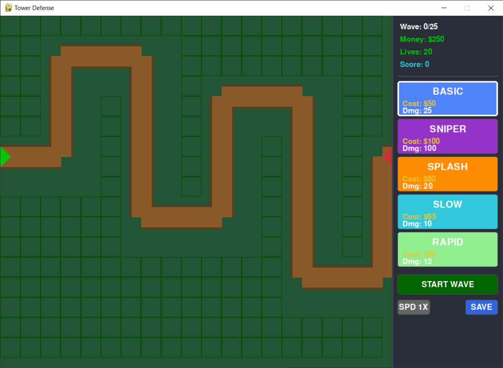
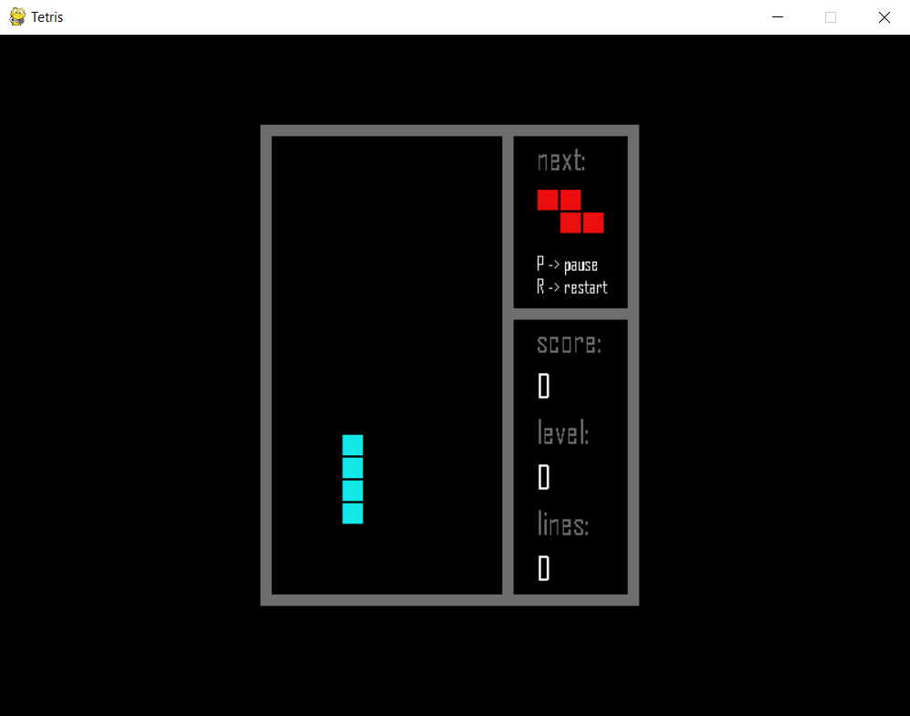
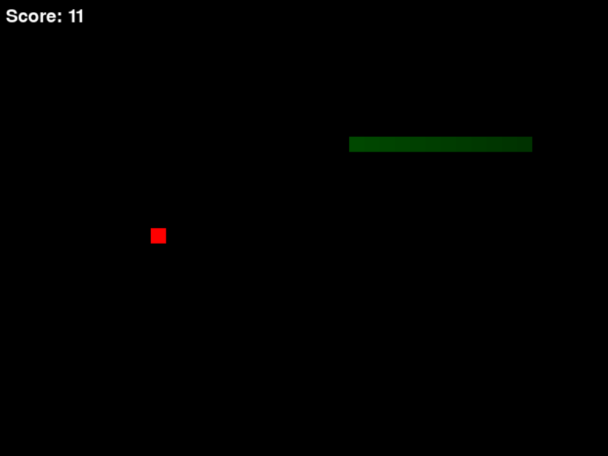
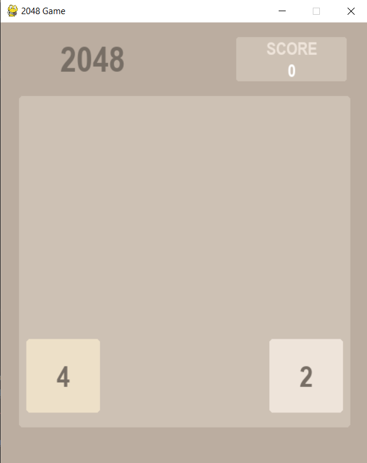

# Pygame Showcase

A collection of small, polished games built using **Python** and **Pygame**.  
This repository is meant for learning, experimentation, and showcasing Python-based game development.

Each game is self-contained in its own folder and includes everything needed to run or study it.

---

## Repository Structure

Each game folder contains:

- Python source code (`.py`)
- `requirements.txt`
- A dedicated README explaining gameplay, controls, and features

This structure keeps each game isolated and easy to explore.

---

## Games Included

### 1. Tower Defense



A modular Tower Defense game featuring 5 distinct tower classes, enemy waves with progressive difficulty, a robust upgrade system, and persistent save/load functionality.

**Folder:** [tower-defense](https://github.com/dsouza-shaun/pygame_showcase/tree/main/tower-defense)

---

### 2. Tetris



A classic Tetris clone featuring a complete scoring system, progressive difficulty, next-piece preview, and authentic mechanics including line-clear animations.

**Folder:** [tetris-game](https://github.com/dsouza-shaun/pygame_showcase/tree/main/tetris-game)

**Note:** This version is adapted from [ibrahimAtespare's Tetris](https://github.com/ibrahimAtespare/tetris-python) with minor modifications to UI and mechanics.

---

### 3. Chrome Dino


A faithful recreation of the classic Chrome Dino Run game featuring smooth animations, accurate hitbox collision, and progressive speed increases.

**Folder:** [chrome-dino](https://github.com/dsouza-shaun/pygame_showcase/tree/main/chrome-dino)

---

### 4. Snake Game



A modern version of the classic Snake game featuring screen wrapping, increasing speed, and special food mechanics.

**Folder:** [snake-game](https://github.com/dsouza-shaun/pygame_showcase/tree/main/snake-game)  
Includes `snake_game.exe` for Windows users in the `snake-game/dist/` folder

---

### 5. 2048 game



The classic sliding tile puzzle game featuring smooth inputs, score tracking, high score persistence, and a clean visual style matching the original.

**Folder:** [2048-game](https://github.com/dsouza-shaun/pygame_showcase/tree/main/2048-game)

More games will be added over time.

---

## Running Games from Source

### Recommended: Create a Virtual Environment

It is **strongly recommended** to run these games inside a virtual environment (venv).  
This keeps dependencies isolated and avoids conflicts with other Python projects.

### Create a Virtual Environment

From the project root:

```bash
python -m venv venv
```

### Activate the Virtual Environment

**Windows (PowerShell / CMD):**
```bash
venv\Scripts\activate
```
**macOS:**
```
source venv/bin/activate
```

### Install Dependencies

**With the virtual environment activated:**
```bash
pip install -r requirements.txt
```
**Or install Pygame directly:**
```bash
pip install pygame
```

---

## Run a game

### Navigate to the game folder and run:
```bash
python main.py
```

---

## License

This project is licensed under the MIT License.  
See the `LICENSE` file for details.
