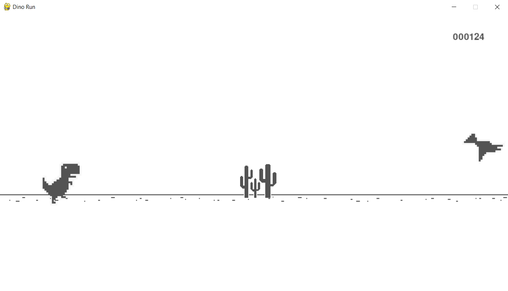

# Chrome Dino Game

A faithful recreation of the classic Chrome Dino Run game built using Python 3.13 and Pygame.  
The game features smooth animations, accurate hitboxes, progressive difficulty, and an authentic visual style inspired by the original.

---

## Features
- Smooth running, jumping, and ducking animations
- Accurate hitbox-based collision detection
- Progressive speed increase with score
- Classic zero-padded score display (e.g. 000089)
- Flying birds and ground obstacles
- Infinite scrolling ground
- Clean start and restart screen

---

## Controls
- UP Arrow — Jump
- DOWN Arrow — Duck
- Any Key — Start / Restart

---

## Run from Source

### Requirements
Python **3.13+**  
Install dependencies:
Package                   Version
------------------------- --------
pygame                    2.6.1

---

## License
This project is licensed under the MIT License.  
You are free to use, modify, and distribute the code.
